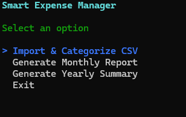
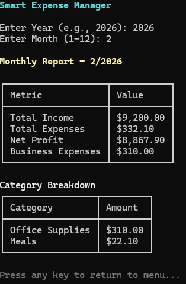
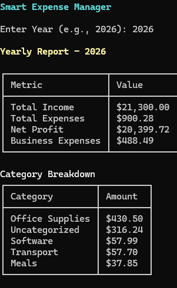

# 📌 Smart Expense Manager

A .NET Core Console Application that helps individuals and small
business owners manage, categorize, and analyze their expenses from CSV
files.

------------------------------------------------------------------------

## 🚨 Problem

Managing expenses manually in Excel or notebooks becomes:

-   Time-consuming\
-   Error-prone\
-   Hard to analyze monthly & yearly trends\
-   Difficult to separate personal and business expenses

Many people download bank statements in CSV format but lack a
lightweight tool to process and analyze them efficiently.

------------------------------------------------------------------------

## 💡 Idea

Build a simple, fast, console-based expense manager that:

-   Imports CSV bank statements
-   Automatically categorizes transactions
-   Stores them locally in JSON
-   Generates monthly & yearly reports
-   Separates business expenses
-   Provides clean CLI-based reporting

------------------------------------------------------------------------

## ✅ Solution

Smart Expense Manager allows users to:

1.  Import transaction data from CSV files\
2.  Automatically categorize transactions\
3.  Store processed data in JSON format\
4.  Generate:
    -   Monthly reports
    -   Yearly summaries
5.  View category-wise breakdown
6.  Track business expenses separately

------------------------------------------------------------------------

## ✨ Features

-   📂 CSV Import
-   🏷 Automatic Categorization
-   💾 Persistent JSON Storage
-   📊 Monthly Report Generation
-   📈 Yearly Summary Report
-   💼 Business Expense Tracking
-   🎨 Clean CLI Output using Spectre.Console
-   🔐 Environment Variable Based Storage Path
-   🧩 Dependency Injection using
    Microsoft.Extensions.DependencyInjection

------------------------------------------------------------------------

## 🛠 Technologies Used

-   .NET 9 (Console Application)
-   C#
-   Spectre.Console
-   Microsoft Dependency Injection
-   JSON Serialization
-   Git & GitHub
-   SSH Authentication

------------------------------------------------------------------------

## 📁 Project Structure

    SmartExpenseManager/
    │
    ├── Models/
    ├── Services/
    │   ├── CsvImportService.cs
    │   ├── CategorizationService.cs
    │   ├── StorageService.cs
    │   └── ReportService.cs
    │
    ├── Program.cs
    ├── README.md
    └── SmartExpenseManager.csproj

------------------------------------------------------------------------


## ⚙️ Setup & Run Locally

### 1️⃣ Clone the repository

``` bash
git clone git@github.com:M-anisha-coder/Smart-expense-manager.git
```

### 2️⃣ Navigate into the project

``` bash
cd Smart-expense-manager
```

### 3️⃣ Restore dependencies

``` bash
dotnet restore
```

### 4️⃣ Run the application

``` bash
dotnet run
```

------------------------------------------------------------------------

## 🌍 Optional: Set Custom Storage Path (Environment Variable)

By default, the app stores data inside:

    /data/transactions.json

To change storage location:

### Windows (CMD)

``` bash
setx SMART_EXPENSE "D:\ExpenseData"
```

Restart terminal after setting.

If environment variable is not set, it falls back to default folder.

------------------------------------------------------------------------

## 📊 Sample CSV Format

    Date,Description,Amount
    2026-01-01,Stripe Payment,8400
    2026-01-02,Amazon Purchase,-120.50
    2026-01-03,Uber Ride,-25.30
    2026-01-04,Starbucks Coffee,-15.75
    2026-01-05,Google Workspace,-12.00
    2026-01-06,Microsoft Azure,-45.99
    2026-01-07,Client Wire Transfer,2500
    2026-01-08,Office Depot,-230.00
    2026-01-09,Netflix Subscription,-18.99
    2026-01-10,Paypal Payment,1200
    2026-01-11,Lyft Ride,-32.40
    2026-01-12,Random Local Store,-67.25
    2026-02-01,Stripe Payment,9200
    2026-02-03,Amazon Web Services,-310.00
    2026-02-05,Starbucks Coffee,-22.10

------------------------------------------------------------------------
---

## 🖥 Application Preview

### 🔹 Main Menu


### 🔹 Monthly Report


### 🔹 Yearly Summary


---


## 🔮 Future Improvements

-   AI-based smart categorization
-   Budget limits & alerts
-   Export reports to PDF
-   SQLite integration
-   Web API version
-   Dashboard UI
-   Authentication & multi-user support

------------------------------------------------------------------------

## 👩‍💻 Skills Demonstrated

-   Clean Architecture Thinking
-   Service-Based Design
-   Dependency Injection
-   File Handling
-   JSON Serialization
-   Exception Handling
-   Git & Multi-Account SSH Setup
-   Console UI Enhancement
-   Environment Configuration
-   Problem-Solving & Debugging

------------------------------------------------------------------------

## 📌 Author

**Manisha**\
FullStack .NET Developer\
Passionate about building practical, real-world tools 🚀
